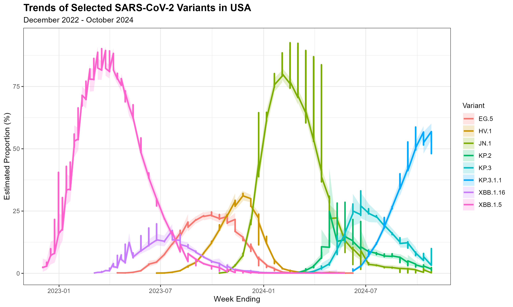

```{r setup, include=FALSE}
knitr::opts_chunk$set(echo = FALSE, warning = FALSE, message = FALSE, 
                      fig.width = 10, fig.height = 6)
library(tidyverse)
library(kableExtra)
```

# Introduction

This analysis examines the temporal patterns of SARS-CoV-2 variant emergence and dominance in the United States from December 2022 through October 2024. We focus on variants that achieved significant prevalence (>5%), representing successive waves of viral evolution and replacement.

**Key Research Questions:**
1. How quickly did dominant variants emerge and decline?
2. What were the peak prevalence levels for each variant?
3. How do replacement dynamics compare across different variant families?

---

# Methods

## Data Source
Data from CDC's SARS-CoV-2 Variant Proportions dataset (https://data.cdc.gov/Laboratory-Surveillance/SARS-CoV-2-Variant-Proportions/jr58-6ysp)

## Variant Selection Criteria
- Variants that achieved >5% national prevalence
- Time period: December 2022 - October 2024
- Geographic scope: United States (national level)

## Data Processing

```{r load-processed-data}
# Load pre-processed data
var_USA <- readRDS("../output/processed_data.rds")

# Display dataset info
cat("Analyzed dataset:", nrow(var_USA), "rows\n")
cat("Time range:", as.character(min(var_USA$week)), "to", 
    as.character(max(var_USA$week)), "\n")
cat("Number of unique variants:", n_distinct(var_USA$variant), "\n")
```

**Variants analyzed:** XBB.1.5, XBB.1.16, EG.5, HV.1, JN.1, KP.2, KP.3, KP.3.1.1

---

# Results

## Summary Statistics

```{r summary-table}
# Load pre-computed summary statistics
summary_stats <- readRDS("../output/tables/summary_stats.rds")

# Display formatted table
summary_stats |>
  kable(
    col.names = c("Variant Family", "Period", "Total Weeks",
                  "Mean %", "Peak %", "Peak Month", "Weeks >30%"),
    align = "lcccccc",
    caption = "Variant Prevalence Summary"
  ) |>
  kable_styling(bootstrap_options = c("striped", "hover"),
                full_width = FALSE, latex_options = "HOLD_position") |>
  column_spec(1, bold = TRUE, width = "2.5cm") |>
  add_header_above(c(" " = 2, "Prevalence Metrics" = 3, "Dominance" = 2))
```

```{r emergence-decline-table}
# Load pre-computed emergence/decline data
emergence_decline <- readRDS("../output/tables/emergence_decline.rds")

# Display formatted table
emergence_decline |>
  kable(
    col.names = c("Variant Family", "First Detect", "Peak Week", "Last Detect",
                  "Peak %", "Weeks to Peak", "Weeks Decline", 
                  "Rise Rate (%/wk)", "Fall Rate (%/wk)"),
    align = "lcccccccc",
    caption = "Emergence and Decline Dynamics"
  ) |>
  kable_styling(bootstrap_options = c("striped", "hover"),
                full_width = FALSE, latex_options = "HOLD_position") |>
  column_spec(1, bold = TRUE) |>
  add_header_above(c(" " = 4, "Peak" = 1, "Duration" = 2, "Speed" = 2))
```

### Interpretation

The summary statistics analysis reveals that true variant dominance patterns with XBB lineages and JN.1 achieving the highest peaks at 90.2% and 96.4% respectively, demonstrating clear epidemic waves. XBB lineages emerged most rapidly (5.64%/week) reaching 90% dominance in just 15 weeks (December 2022 to March 2023) but declined slowly over 62 weeks (March 2023 to May 2024), while JN.1 showed similarly fast emergence (5.07%/week over 18 weeks from October 2023 to February 2024) with moderate 36-week decline. 

EG.5 and HV.1 remained sub-dominant with peaks around 25% in September and November 2023 respectively, exhibiting slower emergence rates (0.98-1.40%/week over 22-24 weeks), while the FLiRT variants showed an unusual pattern of slow 32-week emergence (February to September 2024) but extremely rapid 4-week decline (11.74%/week through October 2024), suggesting aggressive displacement by subsequent variants. The "Weeks >30%" metric confirms XBB (347 weeks cumulative across variants) and JN.1 (243 weeks) as truly dominant, while others achieved only brief or no dominance periods.

```{r overlap-analysis}
# Load overlap analysis
overlap_analysis <- readRDS("../output/tables/overlap_analysis.rds")

cat("\nWeeks with multiple variants >5%:", 
    sum(overlap_analysis$n_variants > 1), "\n")
cat("Maximum concurrent variants:", 
    max(overlap_analysis$n_variants), "\n")
```

## Data Visualization

```{r variant-trends-figure, fig.cap="Temporal trends of SARS-CoV-2 variants in the USA showing sequential replacement dynamics"}
# Load and display the pre-generated figure

```

### Interpretation

The temporal trends clearly illustrate sequential variant replacement dynamics with minimal overlap between dominant strains. XBB.1.5 dominated early 2023, followed by a brief competition period where EG.5 and HV.1 co-circulated at moderate levels without achieving dominance, before JN.1 swept through in early 2024 reaching near-complete prevalence. 

The FLiRT variants (KP.2, KP.3, KP.3.1.1) show staggered emergence in mid-2024 with KP.3.1.1 rising as others decline, demonstrating within-family competition. The overlap analysis confirms relatively clean succession with only 38 weeks showing multiple variants >5% and maximum 4 concurrent variants, indicating that despite co-circulation periods, dominant variants typically achieved near-monopoly prevalence rather than stable coexistence.

---